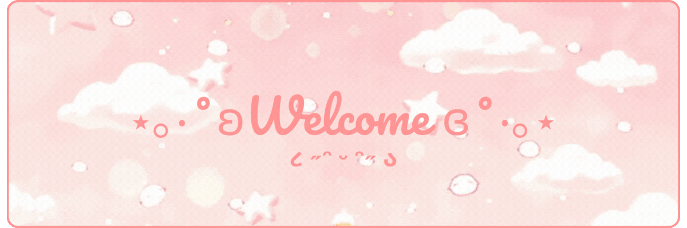
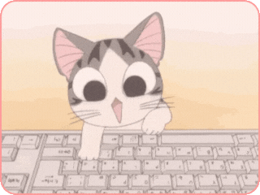
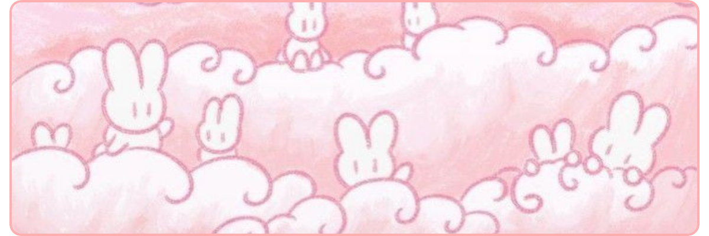

---
# 𝒜𝒷𝑜𝓊𝓉 𝑀𝑒 ૮₍´˶• . • ⑅ ₎ა

 

- 🎀 **Name:** Bianca

- 📍 **Location:** Brazil

- 🎓 **Education:** Student of Systems Analysis and Development

- 🌐 **Languages:** Portuguese, English, Korean

 
 

---

  
## ℒℯ𝒶𝓇𝓃𝒾𝓃ℊ (˶ᵔ ᵕ ᵔ˶)

 

---

  
# ℳ𝓎 𝒮𝓉𝒶𝓉𝓈 ꒰ᐢ. .ᐢ꒱₊˚⊹

   

---

  
  ## ℒ𝒾𝓈𝓉ℯ𝓃𝒾𝓃ℊ 𝒩ℴ𝓌 ✩°｡⋆⸜ 🎧✮

  

---

  

  

  

---
